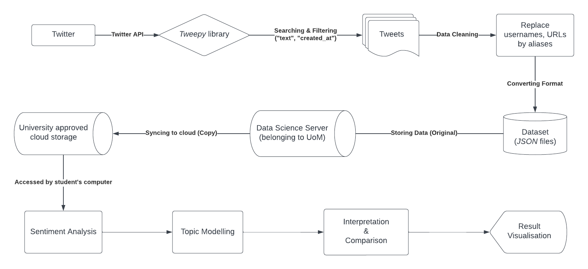

# Third Year Project

---

## General Information

### Author Information:

> **Author Name:** Anqi Tang

> **Supervisor:** Prof. Goran Nenadic

### Project Title

> Analysis of public perception and emotion of COVID-19 on Twitter

### Project Description

#### Aims

> This project is divided into two parts: *sentiment analysis* and *topic modelling*, aiming to analyse the sentiment of tweets discussing COVID-19 and to extract most commonly discussed COVID-19 related topics. 

#### Objectives

### Table of Content
- [Third Year Project](#third-year-project)
  - [General Information](#general-information)
    - [Author Information:](#author-information)
    - [Project Title](#project-title)
    - [Project Description](#project-description)
      - [Aims](#aims)
      - [Objectives](#objectives)
    - [Table of Content](#table-of-content)
  - [Data Preparation](#data-preparation)
    - [Data Source](#data-source)
    - [Data Storage](#data-storage)
    - [Training Data](#training-data)
    - [File List](#file-list)
  - [First Part - Sentiment Analysis](#first-part---sentiment-analysis)
    - [Brief Introduction](#brief-introduction)
    - [File List](#file-list-1)
  - [Second Part - Topic Modelling](#second-part---topic-modelling)
    - [Brief Introduction](#brief-introduction-1)
    - [File List](#file-list-2)

---

## Data Preparation

### Data Source

Data were collected on **Twitter** using a set of pre-defined keywords: `(covid OR covid19 OR covid-19 OR coronavirus OR (corona virus) OR pandemic)`. The *re-tweets* were excluded and only *English* tweets were collected.

The meta data of tweet counts per day were saved in a dedicated file as well.

### Data Storage

All data were collected and stored on **DataScience Server** belonging to the University of Manchester.

### Training Data

The labels of training data were manually annotated by the author, Anqi Tang, as the golden standard. *ChatGPT*, *VADER* and *TextBlob* were also applied to annotate the training data, which were used as the baseline for comparison.

### File List

`tweets_collector.ipynb`
: This is the notebook for collecting tweets from Twitter.

`sentiment_annotator.ipynb`
: This is the notebook for annotating the sentiment of tweets, using *ChatGPT*, *VADER* and *TextBlob*.

---

## First Part - Sentiment Analysis

### Brief Introduction

In the first part of the project, I trained a model to predict whether a given tweets was negative, neutral or positive sentiment based on the text of the review.

Techniquely, I **fine-tuned a pre-trained *BERT* model** (e.g. "distilbert-base-uncased" provided by Hugging Face) through adding one extra sequential layer on top of the *BERT* model using *PyTorch*. To improve the accuracy of prediction further, I **implemented ensemble learning**, *Bootstrap Aggregating (Bagging) algorithm*, to combine multiple models as an ensemble to make the "[Majority Voting](https://en.wikipedia.org/wiki/Majority_rule)" prediction.

### File List

`sentiment_analyser.ipynb`  
: This is the **main** notebook for sentiment analysis task. It includes model functions of fine-tuning (training), evaluation, prediction, and so on.
: The detailed instruction is inside the notebook.

---

## Second Part - Topic Modelling

### Brief Introduction

In the second part, I implemented topic modelling to extract the most commonly discussed topics related to COVID-19 on Twitter.

Techniquely, I implemented a topic modelling model using *BERTopic*. To optimise the model performance, I customised the ***BERTopic* model** by using a **transformer embedding** model, a ***UMAP* dimensionality reduction** layer, a ***HDBSCAN* clustering** layer, a **tokenisation, lemmatisation and vetorisationand** layer, and a **c-TF-IDF cluster tagging** layer.

Additionaly, *Gensim's LDA model* was also implemented to compare the performance.

### File List
`topic_modelling.ipynb` 
: This is the **main** notebook for topic modelling task. It includes the implementation to create clusters of topics.
: The detailed instruction is inside the notebook.

`gensim_topic_modelling.ipynb`
: This is the notebook for topic modelling using *Gensim's LDA model*, which was used for comparison.
